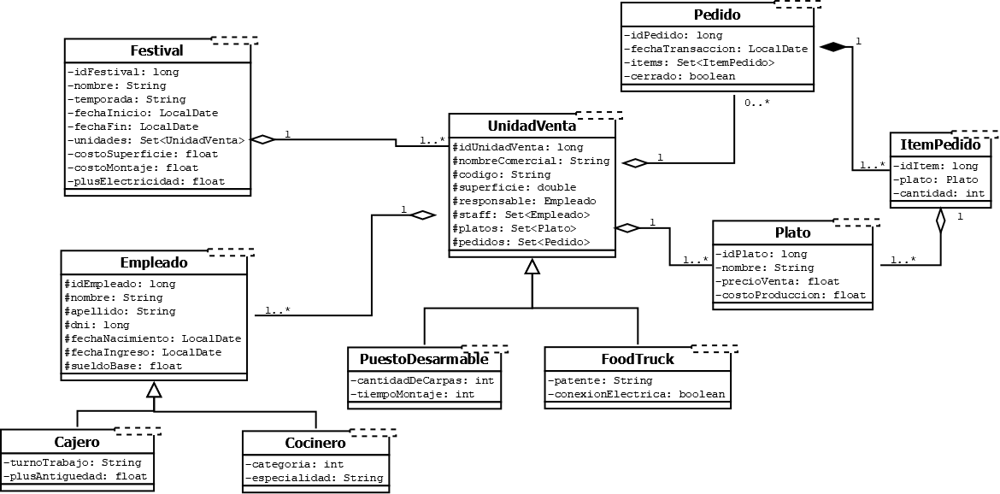

# Sistema de Gestión "Epicentro Gourmet"

Proyecto desarrollado para la asignatura [Orientación a Objetos 2] - [2026 - Segundo Cuatrimestre].
Este software permite gestionar los festivales temáticos de "Epicentro Gourmet", sus unidades de venta, el personal asignado, los platos ofrecidos, los pedidos y el rendimiento económico de cada jornada.

## 👥 Equipo de Trabajo
- **Leal, Arian Gabriel** (@ari2709) - Desarrollador
- **Ledesma Miño, Alejandro Javier** (@AJLM97) - Desarrollador
- **Boullon, Juan Bautista** (@JuanBa7) - Desarrollador
- **Vogt, Thomas Gebhard** (@Thomy98) - Desarrollador

## 🛠️ Requisitos Iniciales
1. Crear la base de datos en MySQL ejecutando la siguiente consulta:
	`create database bd_tp_grupal_oo2_grupo11;`
2. Ingresar el usuario y la contraseña de MySQL en `src/hibernate.cfg.xml`, en las propiedades `connection.username` y `connection.password`.
	(Actualmente, la configuración utiliza el usuario `root` y la contraseña `root`).
3. Ejecutar el archivo `src/test/TestInicializar.java` para cargar los datos iniciales.

## 📑 Diagrama

## ✨ Test Complejos
- **Leal, Arian Gabriel**
    `src/test/Leal_TestTraerEmpleadoMasAntiguo.java`
    Este test traerá al empleado más antiguo de una unidad de venta.
- **Ledesma Miño, Alejandro Javier**
    `src/test/Ledesma_TestTraerUnidadVentaQueMasRecaudo.java`
    Este tres traerá a la unidad de venta que más recaudó en un festival.
    `src/test/Ledesma_TraerPlatoMasRentableDeUnidadVenta.java`
    Este test traerá al plato que más resultó rentable de una unidad de venta.
    rentabilidad = (precio de venta - costo de producción) * unidades vendidas
- **Vogt, Thomas Gebhard**
    `src/test/Vogt_TraerPlatoEstrellaPorRecaudacion.java`
    Este test traerá al plato que más dinero recaudó entre una fecha inicial y una fecha final de una unidad de venta.
    `src/test/Vogt_TraerPlatoEstrellaUnidadDeVenta.java`
    Este test tarea al plato que más veces fue comprado en una unidad de venta.
    `src/test/Vogt_TraerPlatoEstrellaUnidadEntreFechas.java`
    Este test traerá al plato que más veces fue comprado entre una fecha inicial y una fecha final de una unidad de venta.